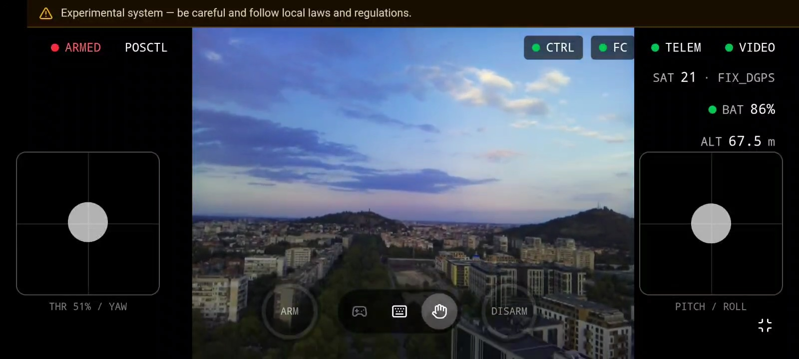

<p align="center">
  
</p>

<h1 align="center">Drone Grid</h1>

<p align="center"><em>An open-source cloud platform for operating drones in near real time.</em><p>

---
<p align="center">
  <a href="docs/content/assets/video/landing-demo.mp4">
    
  </a>
</p>


<div align="center">

| [Public instance](https://drone-grid.com) | [Documentation](https://docs.drone-grid.com) |
| ---------------------------------------------------- | -------------------------------------------- |

</div>

> [!WARNING]
> This system is in an experimental state. [Safety Recommendations](https://docs.drone-grid.com/hardware/) can be found in the documentation, but they are no substitute for your local laws and regulations — you are solely responsible for complying with the legal framework applicable in your area when controlling unmanned aerial vehicles.

## Quick start for local development and testing

**Prerequisites:** [Docker](https://docs.docker.com/engine/install/) or a Docker Compose-compatible container runtime.

- Linux (tested on Ubuntu 24.04 LTS) & macOS

```shell
bash scripts/run_drone_grid.sh
```

Then open a browser on any computer that is connected to your local area network and access your local instance over mDNS:
```
http://<HOSTNAME_OF_YOUR_MACHINE>.local
```

You may then register a user and proceed with configuring your first drone.

Windows has not been tested for development.
mDNS may not work as expected with WSL and virtualization in general.
Currently, dual booting Ubuntu is the recommended solution for running Drone Grid locally on a Windows machine.
