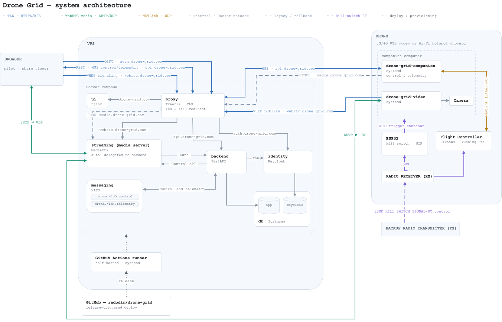

---
hide:
  - toc
  - navigation
---

# Architecture

!!! info "Architecture diagram tools"

    The diagram is exported as an SVG image from draw.io. The diagram will be maintained as the system evolves. Click the diagram to see it in all of its glory.

## Components

| Component                                           | Role                                                                                                                                                                                                                 |
| --------------------------------------------------- | -------------------------------------------------------------------------------------------------------------------------------------------------------------------------------------------------------------------- |
| **ui** `services/ui`                             | client for viewing the drone's live video stream and telemetry - sends control commands to the backend                                                                                                               |
| **backend** `services/backend`                   | the backend that makes everything come together                                                                                                                                                                      |
| **identity** `config/keycloak`                   | Identity server — users and roles only, authorization is implemented in the backend                                                                                                                                  |
| **db** `config/postgres`                         | Central DBMS                                                                                                                                                                                                         |
| **messaging**                                       | NATS messaging system - each drone has its own subjects for both control and telemetry                                                                                                                               |
| **streaming (media server)** `config/mediamtx`   | MediaMTX media server - every publish/read is authorized by the backend                                                                                                                                              |
| **proxy** `compose.yaml`                         | reverse proxy and TLS                                                                                                                                                                                                |
| **companion** `services/companion`               | responsible for converting the control commands to mavlink messages and publishing back telemetry over the same WebSocket connection                                                                                 |
| **video** `services/companion/deploy`            | MediaMTX container streaming live video from the companion camera                                                                                                                                                    |
| **Kill switch** `embedded/esp32/kill_switch.ino` | ESP32 running a C++ Arduino sketch which upon receiving a kill switch signal from the previously mapped receiver channel shuts down the companion computer - crucial for safe operations with an experimental system |

## Production deployment

The production deployment is initiated via Github actions (.github/workflows/deploy_production.yml). Every time Drone Grid is released the deployment to production is automatically triggered on the self-hosted runner.
This is the initial CI/CD design. The plan is, of course, to introduce an image registry as well as a staging environment with automated tests.