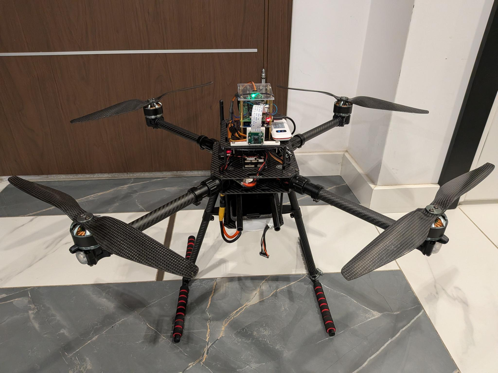
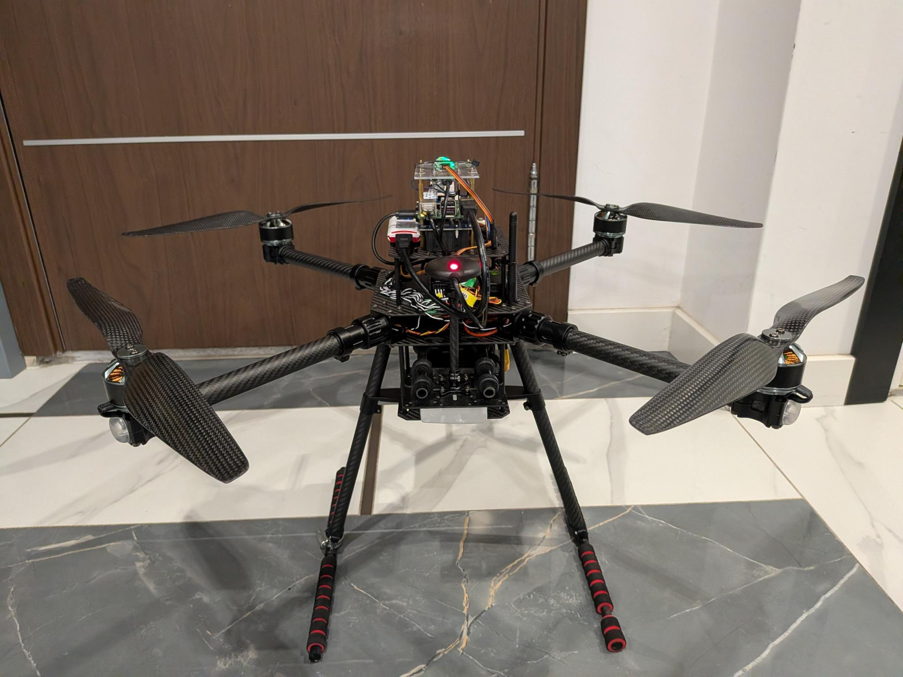
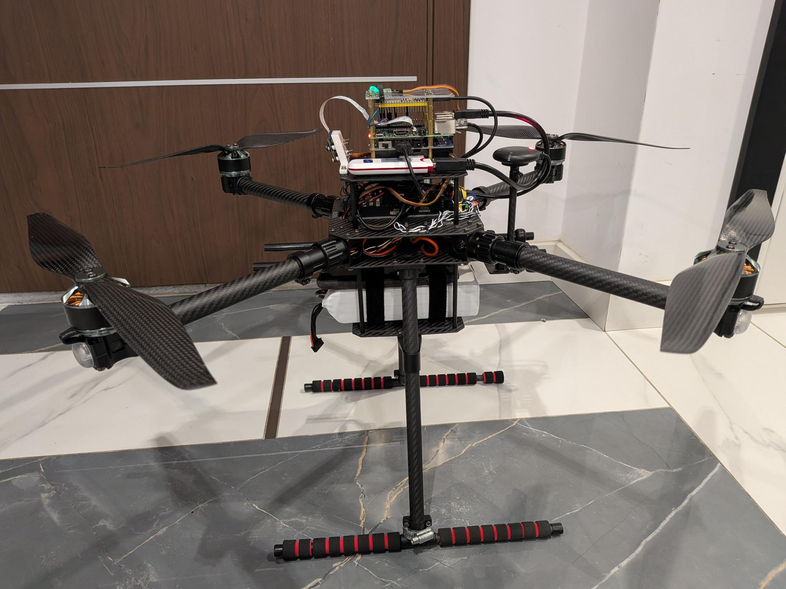
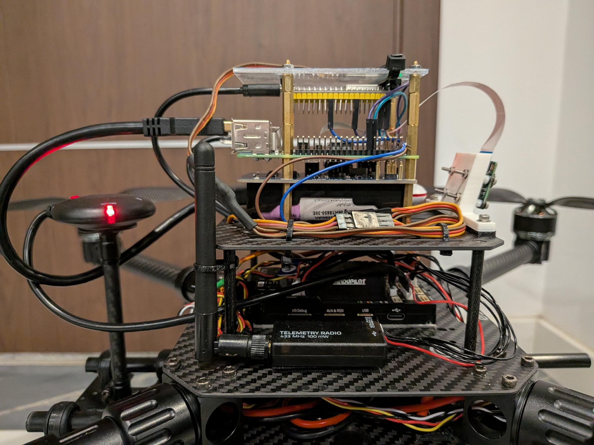
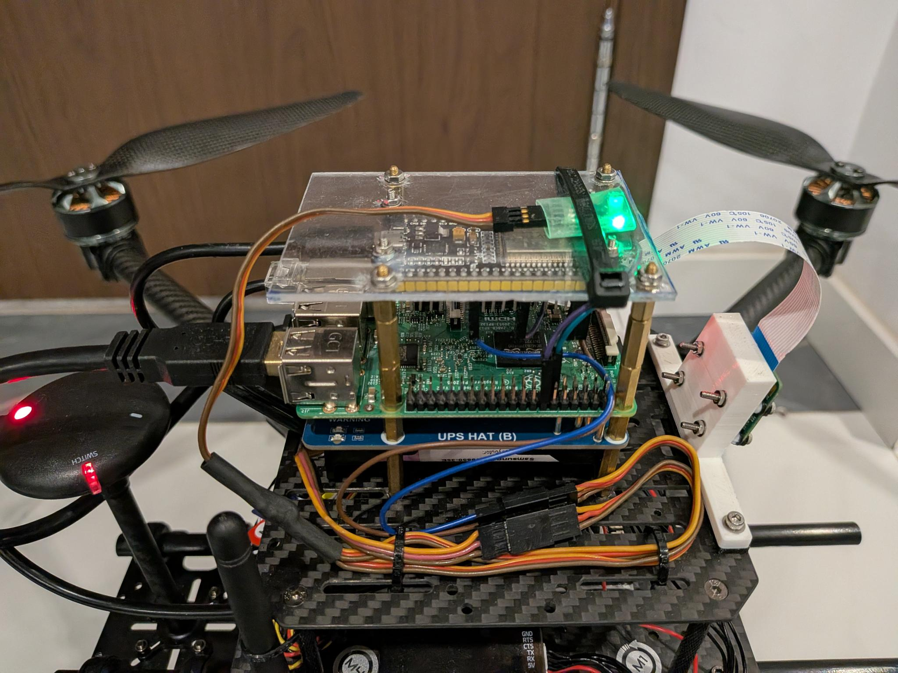
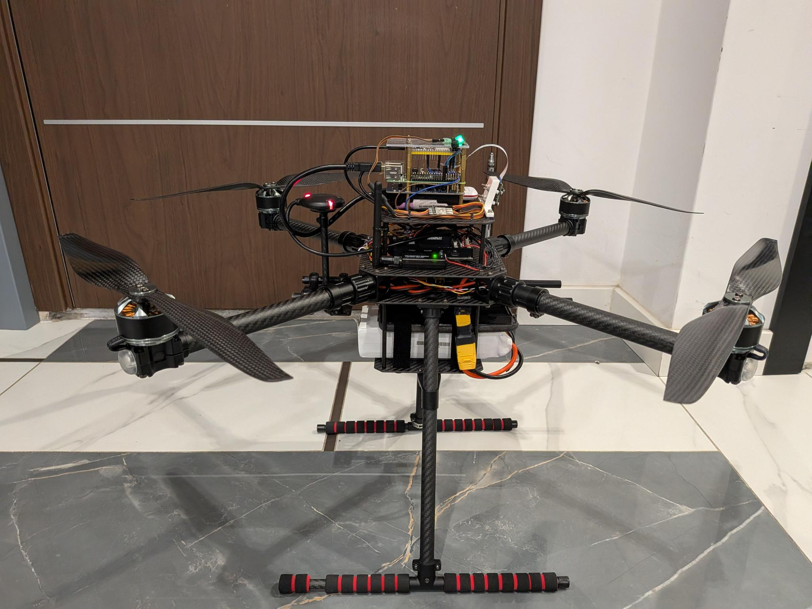
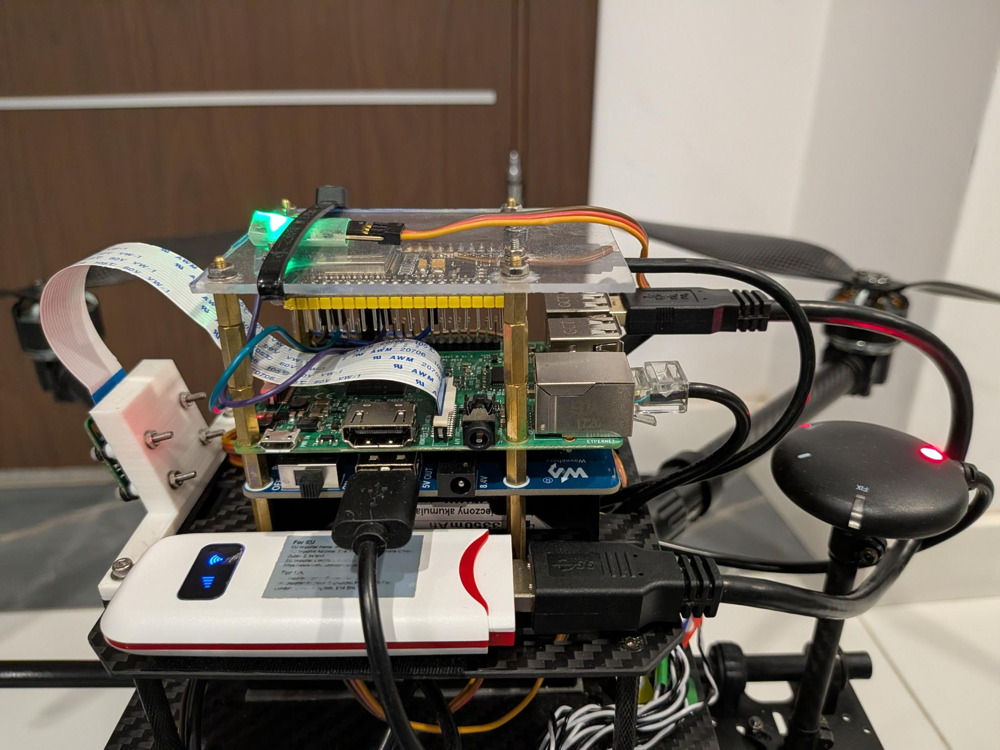
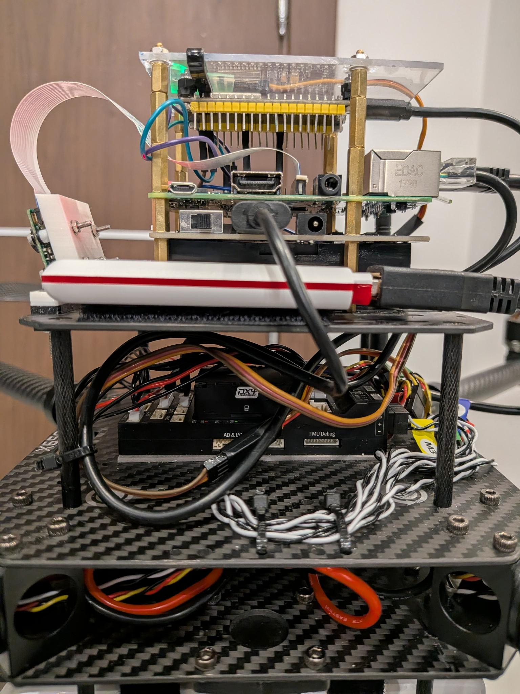

---
hide:
  - toc
---

# X650 with Raspberry Pi 3B

  
  
  
  
  
  
  
  

| Item                                                                                                                                                | Notes                                                                                                                                                                                                                                                                          |
| --------------------------------------------------------------------------------------------------------------------------------------------------- | ------------------------------------------------------------------------------------------------------------------------------------------------------------------------------------------------------------------------------------------------------------------------------ |
| [HolyBro X650 Development Kit ](https://holybro.com/products/x650-development-kit)                                                                  | Pixhawk 6X, M10 GPS and 433 MHz telemetry module (consider allowed frequency bands in your region for the telemetry module) even though it is not a must for Drone Grid it is useful and nice to have                                                                          |
| [Raspberry Pi 3B](https://www.raspberrypi.com/products/raspberry-pi-3-model-b/)                                                                     | 1 GB RAM                                                                                                                                                                                                                                                                       |
| [Raspberry Pi Camera Module v2](https://www.raspberrypi.com/products/camera-module-v2/)                                                             | Do not use the V3 camera - it is not suitable for high-vibration environments                                                                                                                                                                                                  |
| ESP32 development board                                                                                                                             | I cannot find the exact link but it is an old microUSB one with 38 pins                                                                                                                                                                                                        |
| [T8L Radio Controller](https://radiomasterrc.com/products/t8l-radio-controller)                                                                     | You will need two 18650 batteries - make sure they are the correct size and choose the correct transmitter based on your region - e.g. for Europe ELRS is correct                                                                                                              |
| [RP2 V2 ExpressLRS 2.4ghz Nano Receiver](https://radiomasterrc.com/products/rp2-expresslrs-2-4ghz-nano-receiver)                                    | the most fun of all - you can solder pin headers to this receiver then plug it into a servo cable (y-harness) one end goes to kill switch the other goes to the flight controller's RC IN. Choose the correct receiver based on your region - e.g. for Europe ELRS is correct. |
| 4G USB modem                                                                                                                                        | One of the cheapest possible ones you can buy online - it worked for a while until it didn't. I resorted to using an old phone as a Wi-Fi hotspot onboard - I am exploring what cellular hats are more suitable                                                                |
| [Waveshare UPS Hat (B)](https://www.waveshare.com/ups-hat-b.htm)                                                                                    | You will need two 18650 batteries - make sure they are the correct size                                                                                                                                                                                                        |
| [6S Lipo Battery 100C](https://chinahobbyline.com/products/cnhl-g-plus-6000mah-22-2v-6s-100c-lipo-battery-with-xt90-plug)                           | you will need an XT90 to XT60 adapter                                                                                                                                                                                                                                          |
| [Lipo Battery charger](https://power.tenergy.com/tenergy-tb6b-multifunctional-balance-charger-for-nimh-nicd-li-po-li-fe-battery-packs-power-supply) |                                                                                                                                                                                                                                                                                |
| A mobile data plan                                                                                                                                  | An old phone is also needed or a 5G/4G modem for the companion - more effective hardware solutions are being explored                                                                                                                                                          |
| 3D-printed camera mount                                                                                                                             | [Docs](https://github.com/radodim/drone-grid/blob/main/cad/rpi_cam_v2/README.md)                                                                                                                                                                                               |

!!! Danger "Please be careful when charging batteries. Do not leave them unattended. Always inspect batteries for any visible damage and follow your local laws and regulations."